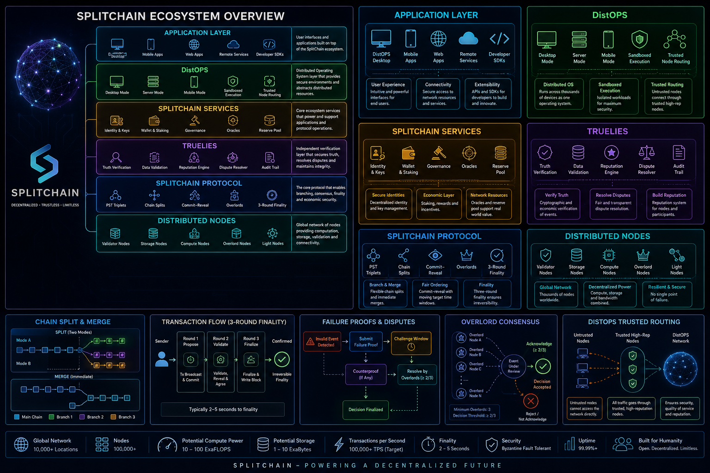
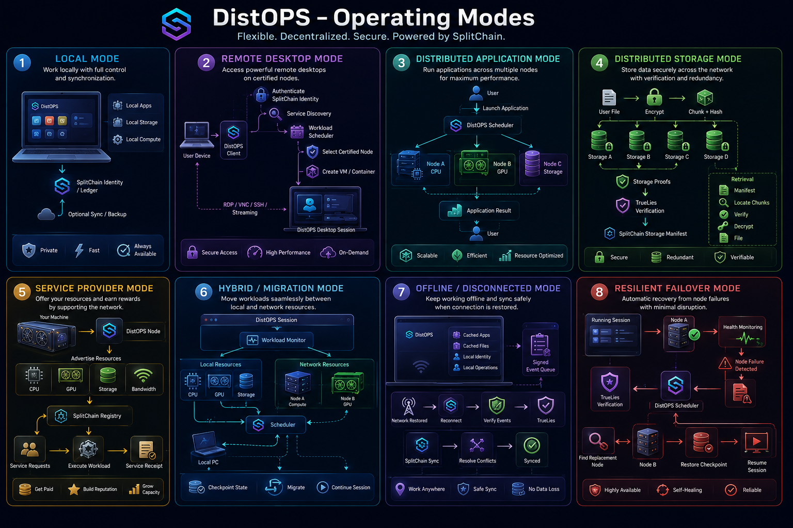
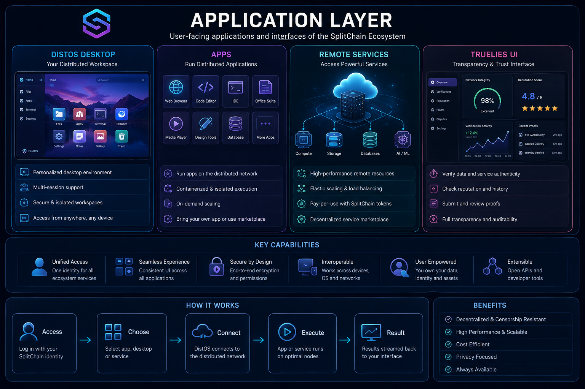
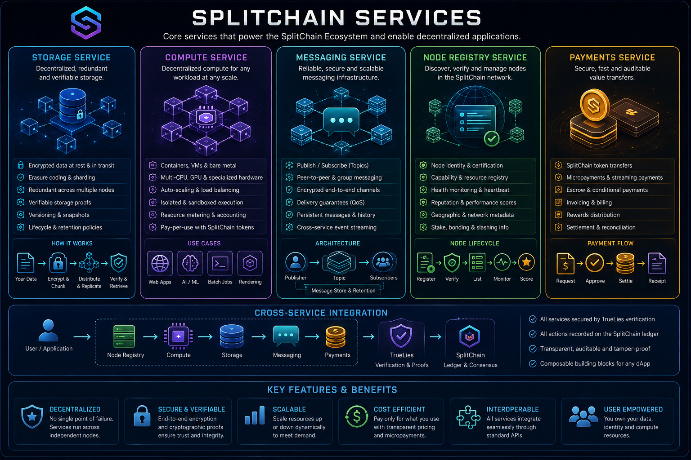
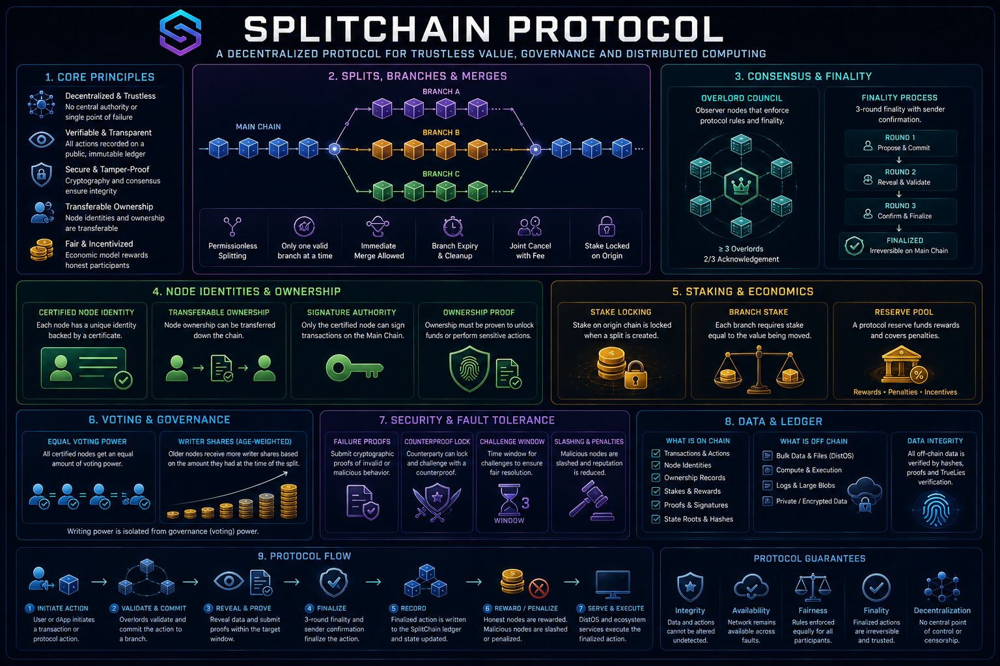
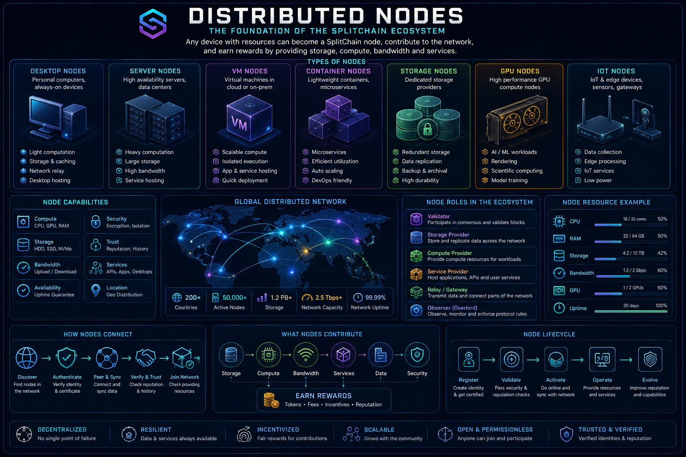

# SplitChain

SplitChain is an **experimental protocol and distributed-computing research ecosystem** built around a canonical ledger with bounded two-party execution branches. The project combines the SplitChain protocol, **DistOPS**, SplitChain Services, **TrueLies**, applications, and distributed nodes into a runnable research baseline.

> **Status:** experimental and unaudited. The repository is a working research baseline, not a production blockchain and not suitable for real assets.

<p align="center"></p>

## Ecosystem

| Layer | Current implementation |
|---|---|
| Applications | `scplit ecosystem-demo` and WebSocket `ecosystem.demo` RPC |
| DistOPS | Trust-aware scheduling, resource checks, approved workloads and sandbox receipts |
| SplitChain Services | Compute-request lifecycle and receipt registry |
| TrueLies | Three local observers, signed attestations, 2/3 quorum and reputation updates |
| SplitChain protocol | Equal-value staked branch, single commitment and three-round finality |
| Distributed nodes | Three hardened `splitd` containers in Compose |

The intended architecture extends this baseline toward a distributed service and compute ecosystem in which nodes can contribute resources while SplitChain provides deterministic settlement and TrueLies provides an observer/proof layer. DistOPS is the current name of the distributed workload/operating layer; **DistOS is a retired historical name**.

## Getting started

For the complete setup and walkthrough, see **[GETTING_STARTED.md](GETTING_STARTED.md)**.

Requires Python 3.11+.

```bash
git clone https://github.com/bokiloki/SplitChain.git
cd SplitChain
python -m venv .venv
. .venv/bin/activate
python -m pip install -e '.[dev]'
pytest -q
scplit ecosystem-demo
```

Windows PowerShell activation:

```powershell
.\.venv\Scripts\Activate.ps1
```

Run the deterministic simulator:

```bash
scplit simulate --seed 42 --steps 500
```

Run a local reference node:

```bash
splitd --host 127.0.0.1 --port 8765
```

Then from another terminal:

```bash
scplit rpc status
scplit rpc offer --params '{"sender":"alice","receiver":"bob","value":10}'
```

Or start the three-node container environment:

```bash
docker compose up --build
scplit rpc ecosystem.demo --url ws://127.0.0.1:8765
```

The lightweight Compose profile needs no Kubernetes cluster. It binds all node ports to
loopback, persists each ledger independently, includes health checks and restart policy,
and caps the three nodes at a combined 1.5 CPUs and 768 MiB of memory.

`splitd` is intentionally unauthenticated and defaults to loopback. Do not expose the reference implementation directly to untrusted networks.

## What works now

- Deterministic branch lifecycle: offer → accept → commit → three-round finality.
- Cancellation and expiry for uncommitted branches.
- Equal-value stake and single-commit enforcement.
- Canonical split-point binding for every branch.
- Canonical JSON and domain-separated hashes for protocol identifiers and commitments.
- Seeded adversarial simulator with invariant checks.
- Local JSON-over-WebSocket `splitd` reference node.
- Optional TLS 1.3-only mutual certificate authentication for `splitd` and `scplit`.
- Optional certificate-fingerprint registry binding mTLS peers to unique node IDs and roles.
- Optional authenticated RPC envelopes with actor binding and replay rejection.
- Atomic reference-node state persistence and invariant-checked restart recovery.
- Persistent replay nonces across authenticated node restarts.
- Deterministic three-node branch-scoped gossip with certificate, signature and sequence checks.
- Certified Primary/Secondary/Tertiary acknowledgements with 2/3 quorum across three rounds.
- Proof-gated Primary → Secondary → Tertiary recovery with a three-round counterproof window.
- `scplit` CLI for simulation, RPC and ecosystem demo.
- DistOPS trust-aware workload scheduling and sandbox receipts.
- DistOPS signed-manifest binding, risk/reputation admission, quotas, network policy,
  ephemeral-secret metadata, and deterministic completion proofs.
- Opt-in Docker/containerd runtime adapter with immutable images, attestation checks,
  shell-free argv construction, isolation validation, and runtime-result proofs.
- Replay-resistant runtime attestations, trusted egress gateways that block consensus
  endpoints, and one-time expiring ephemeral-secret leases.
- SplitChain Services request lifecycle.
- Local TrueLies three-observer 2/3 proof quorum and reputation counter.
- TLA+ safety-core model and TLC configuration.
- Tests, CI, threat model, ADRs, RFC workflow, protocol specification and whitepaper draft.

## Confirmed baseline vs research proposals

The executable baseline deliberately implements only mechanisms that can currently be exercised in code and tests. The broader SplitChain design includes research proposals for deterministic timestamp betting/commit-reveal, timestamp-bound branches, rotating observer/PST selection, Overlord acknowledgements, failure proofs and counterproof locks, slashing, reserve-pool rewards, node certification, governance, peer networking and stronger DistOPS isolation.

These remain proposals until they pass the project workflow and are promoted into the confirmed specification. See [`spec/protocol.md`](spec/protocol.md).

## Protocol visual guide

The updated diagrams below explain the proposed full protocol. They are design
documentation, not proof that every mechanism is already implemented.

### DistOPS execution and trust modes

<p align="center"></p>

### Node roles and network boundaries

<p align="center"></p>

### Signed protocol messages

<p align="center"></p>

### Permitted branch types

<p align="center"></p>

### Branch lifecycle

<p align="center"></p>

### Observer-quorum activation gate

<p align="center"></p>

### Deterministic timestamp candidate selection

<p align="center"></p>

### Failure proof and counterproof

<p align="center"></p>

### Partitions, slashing and recovery

<p align="center"></p>

### Node accountability and re-entry

<p align="center"></p>

## Repository map

| Path | Purpose |
|---|---|
| `GETTING_STARTED.md` | Installation and first-run guide |
| `spec/` | Normative executable-draft protocol and proposals |
| `docs/` | Whitepaper and architecture imagery |
| `splitchain/` | Model, simulator, WebSocket node, CLI, DistOPS, Services and TrueLies |
| `tests/` | Deterministic unit and integration tests |
| `formal/` | TLA+ model and TLC configuration |
| `adrs/` | Accepted/provisional architectural decisions |
| `rfcs/` | Proposal workflow |
| `security/` | Threat model and promotion gates |

## Current component visuals

Only reviewed diagrams using current project terminology are displayed here.
Historical and superseded artwork remains in the repository for provenance but
is no longer referenced from the README.

### Application layer

<p align="center"></p>

### SplitChain Services

<p align="center"></p>

### SplitChain protocol

<p align="center"></p>

### TrueLies

<p align="center"></p>

### Distributed nodes

<p align="center"></p>

### Security

<p align="center"></p>

### Development and verification

<p align="center"></p>

## Development process

Protocol changes follow:

**RFC → implementation → simulation → attack analysis → formal verification → revision**

Confirmed changes should be traceable to code/tests or an accepted ADR. Open proposals remain clearly labeled until their implementation, simulation, formal-model and security gates pass.

## License

Apache-2.0. See [`LICENSE`](LICENSE).
